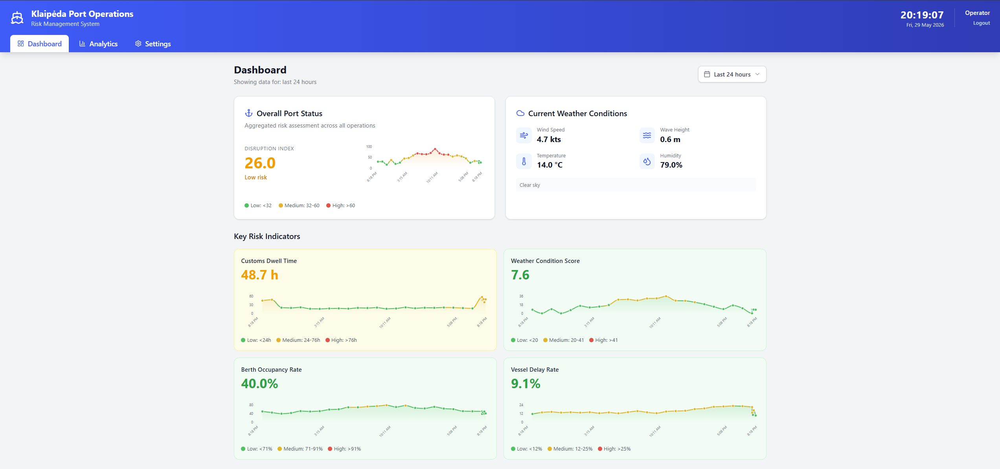
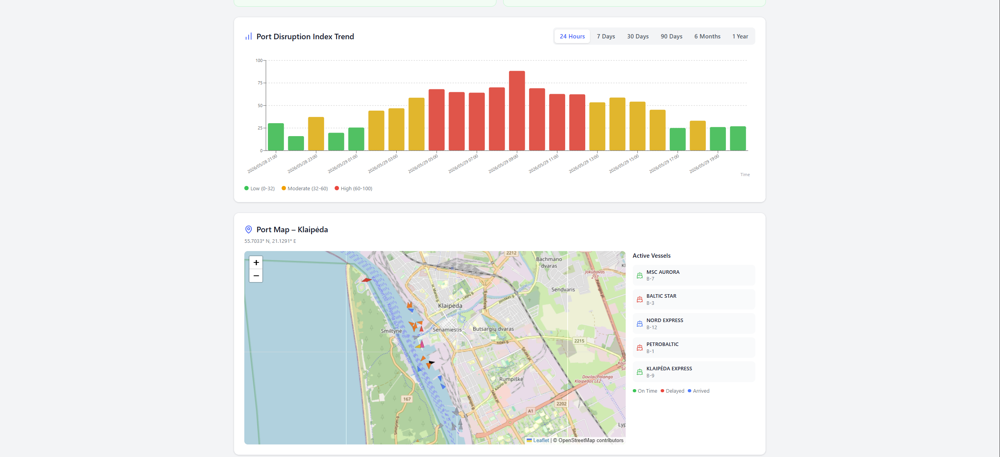
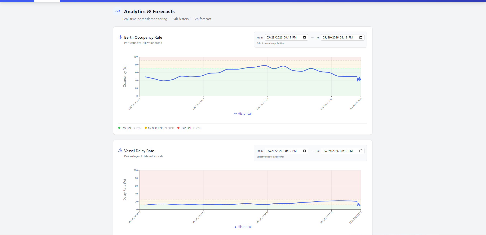

# Kursis by LifeAfterTheDream 

A real-time port operations **risk-monitoring dashboard**. The system ingests live and mock operational signals (vessel AIS positions, weather, berth occupancy, customs dwell time, vessel delay rates), scores them against configurable Key Risk Indicators (KRIs), and raises alerts over SMS and email when thresholds are breached.

> **3rd-year (Semester 6) Software Engineering group project — Programų Sistemų Kurimas.**
> Built to demonstrate object-oriented design, clean and maintainable code infrastructure, and persistence through an ORM (JPA-equivalent: **Entity Framework Core**) over a relational database.

---

## Tech stack

| Layer            | Technology                                                                 |
| ---------------- | -------------------------------------------------------------------------- |
| Frontend         | React 19 + TypeScript, Vite, Tailwind CSS, React Query, Recharts, Leaflet  |
| Backend          | ASP.NET Core 10 Web API (C#), Autofac DI, FluentValidation, Serilog        |
| ORM / Data       | Entity Framework Core 10 (code-first migrations)                           |
| Database         | PostgreSQL 16 (via Docker)                                                  |
| Notifications    | Twilio (SMS) + SMTP (email), pluggable via Strategy + Decorator patterns   |
| Tooling          | Husky (pre-commit hooks), Prettier, ESLint, EditorConfig                   |

## Architecture (multi-layer, OOP)

```
┌──────────────────────────────────────────────────────────┐
│  Presentation     React 19 + Vite          (frontend/)     │
└───────────────────────────┬──────────────────────────────┘
                            │ HTTP / REST
┌───────────────────────────▼──────────────────────────────┐
│  API / Application   ASP.NET Core 10 Web API               │
│    PortRiskMonitor.API          (controllers, filters)     │
│    PortRiskMonitor.Application  (services, notifications)  │
│    RiskMonitor                  (domain library)          │
└───────────────────────────┬──────────────────────────────┘
                            │ EF Core (ORM)
┌───────────────────────────▼──────────────────────────────┐
│  Data Access      PortRiskMonitor.Data  +  PostgreSQL 16   │
└──────────────────────────────────────────────────────────┘
```

The OOP / quality-infrastructure focus shows up in: interface-driven services wired by config (`DynamicStrategies` in `appsettings.json`), interceptors/filters for cross-cutting audit logging, Strategy + Decorator patterns for the notification pipeline, optimistic locking via EF Core row versions, and async background fetcher services.

---

## Prerequisites

- [.NET 10 SDK](https://dotnet.microsoft.com/download/dotnet/10.0)
- [Node.js 20+](https://nodejs.org/) and npm
- [Docker Desktop](https://www.docker.com/products/docker-desktop/) (for the PostgreSQL database)
- EF Core CLI tools (only needed if you add/run migrations manually):
  ```bash
  dotnet tool install --global dotnet-ef
  ```

---
## Demo Images



---
## Setup & running

### 1. Start the database

PostgreSQL runs in Docker. From the `backend/` folder:

```bash
cd backend\PortRiskMonitor.API
docker compose up -d
```

This starts a `postgres:16` container named `portdb`, exposing port **5433** on the host (mapped to 5432 in the container). The connection string is preconfigured in `appsettings.json`:

```
Host=localhost;Port=5433;Database=portrisks;Username=portuser;Password=portpass
```

### 2. Configure secrets (SMS + email)

SMS (Twilio) and email (SMTP) credentials are **not** committed to source control. They are stored using .NET [user-secrets](https://learn.microsoft.com/aspnet/core/security/app-secrets), which the API project is already initialised for (a `UserSecretsId` exists in `PortRiskMonitor.API.csproj`).

From the API project folder, initialise (safe to run even if already initialised) and add your credentials:

```bash
cd backend/PortRiskMonitor.API

# Initialise the secret store for this project
dotnet user-secrets init

# --- Email (SMTP) ---
dotnet user-secrets set "Notifications:Email:FromAddress" "you@gmail.com"
dotnet user-secrets set "Notifications:Email:Username"    "you@gmail.com"
dotnet user-secrets set "Notifications:Email:AppPassword" "your-app-password"

# --- SMS (Twilio) ---
dotnet user-secrets set "Notifications:Twilio:AccountSid"  "ACxxxxxxxx"
dotnet user-secrets set "Notifications:Twilio:AuthToken"   "your-auth-token"
dotnet user-secrets set "Notifications:Twilio:FromNumber"  "+1xxxxxxxxxx"
```

Non-secret options (SMTP host/port, recipient lists, the active `Channel`) live in `appsettings.json` under `"Notifications"`. The active channel is set with `Notifications:Channel` — one of `"Off"`, `"Email"`, or `"Twilio"`.

> The app runs fine without these secrets — set `Notifications:Channel` to `"Off"` to disable outbound alerts during development.

### 3. Run the backend

```bash
cd backend/PortRiskMonitor.API
dotnet run
```

EF Core migrations and seed data are applied automatically on startup, so no manual database setup is required. The API serves at **https://localhost:61303** (Swagger UI at the root in Development mode).

### 4. Run the frontend

In a second terminal:

```bash
cd frontend
npm install
npm run dev
```

Vite serves the app at **http://localhost:5173** and talks to the API at `https://localhost:61303/api`.

---

## Shutting down

Stop the running `dotnet run` and `npm run dev` processes with `Ctrl+C`, then tear down the database container.

```bash
cd backend
docker compose down -v
```

The `-v` flag also removes the `portdb_data` volume, **wiping all database data** — useful for a clean reset, since seed data is re-applied on the next startup. Omit `-v` if you want to keep the data between runs.

---

## Project layout

```
.
├── backend/
│   ├── docker-compose.yml              ← PostgreSQL container
│   ├── PortRiskMonitor.API/            ← Web API, controllers, DI, secrets
│   ├── PortRiskMonitor.Application/    ← Services, background fetchers, notifications
│   ├── PortRiskMonitor.Data/           ← EF Core DbContext, entities, migrations, repos
│   └── RiskMonitor/                    ← Domain library (entities, scoring, contracts)
└── frontend/                           ← React + Vite client
```

## Common commands

| Task                         | Command                                                       |
| ---------------------------- | ------------------------------------------------------------- |
| Start database               | `cd backend && docker compose up -d`                          |
| Stop & wipe database         | `cd backend && docker compose down -v`                        |
| Run API                      | `cd backend/PortRiskMonitor.API && dotnet run`                |
| Run frontend (dev)           | `cd frontend && npm run dev`                                  |
| Lint / format frontend       | `cd frontend && npm run lint` · `npm run format`              |
| Add EF migration             | `dotnet ef migrations add <Name> --project ../PortRiskMonitor.Data` |
| Apply migrations manually    | `dotnet ef database update --project ../PortRiskMonitor.Data` |
